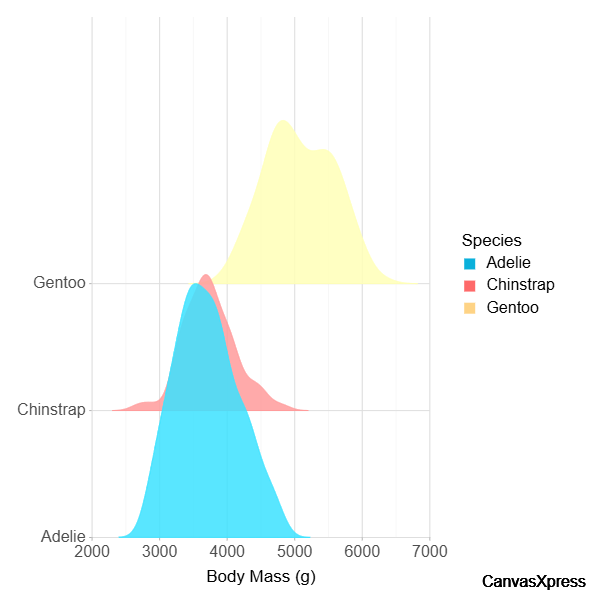

## Visualización Ridgeline de Penguins

Este proyecto muestra la distribución de masa corporal por especie de pingüino usando CanvasXpress.

fuente de los datos: https://www.kaggle.com/datasets/parulpandey/palmer-archipelago-antarctica-penguin-data?select=penguins_size.csv
recursos externos: https://canvasxpress.org/examples/ridge-line-1.html
