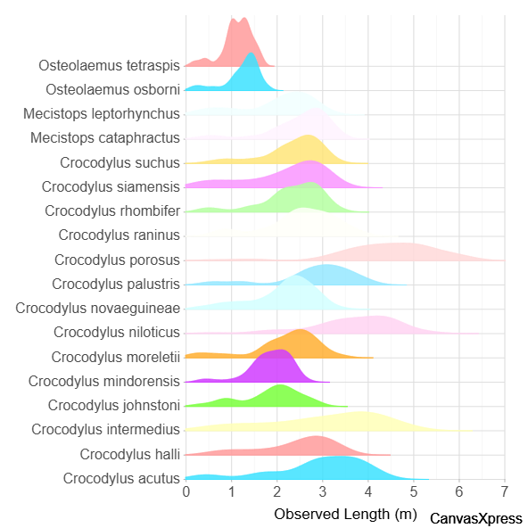

## Visualización Ridgeline de Cocodrilos

Este proyecto muestra la distribución de masa corporal por especie de pingüino usando CanvasXpress.

fuente de los datos: https://www.kaggle.com/datasets/zadafiyabhrami/global-crocodile-species-dataset
recursos externos: https://canvasxpress.org/examples/ridge-line-1.html
